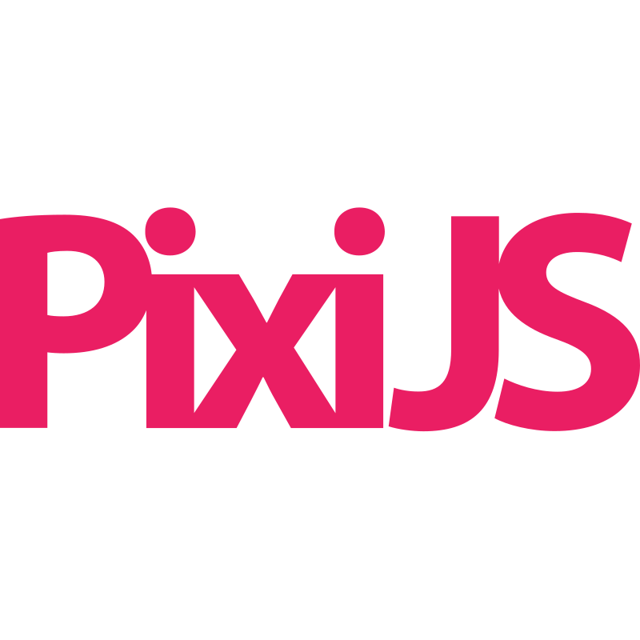

<h2 align="center"> Привет, я <a>Давлат</a> </h2>
<h4 align="center">Web разработчик и магистр передовой инженерной школы</h4>

- 🌱 Нравится создавать что-то сложное, функциональное, чтобы это все смотрелось удобно и красиво.

- 📄 Хотите больше узнать о моем опыте? [**Habr (Ru)**](https://career.habr.com/dazzv_me)

- 🌍 Ссылка на <a href="https://drive.google.com/file/d/1_0FjWwLPqRuRiqjV2jrZvPWH1A76_VoV/view?usp=sharing" target="blank">резюме</a>

- 🔭 Мой Pet-проект <a href="https://yaft.netlify.app/" target="blank">Yaft</a> (mobile-first)
  
- ⚡ Интересный факт обо мне: Я обожаю корги &#128062;

### Напишите мне в:

  
  
  
  

  
<b>Frameworks & инструменты которыми я владею</b>

   
   
   
   
   
   
   
   
   
   
   
   
   
   
   
   
   

