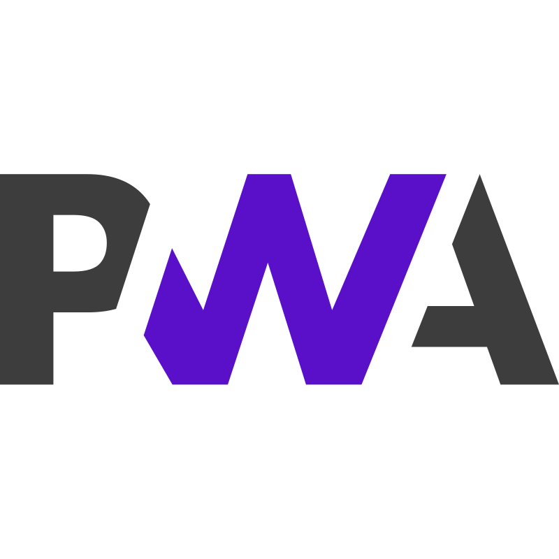

<h1 align="center">Hi there, I'm <a>Davlat</a> </h1>
<h3 align="center">Web developer and AI engineering student</h3>

- 🌱 I'm studying web application development technologies

- 📄 Know about my experiences [**Habr (Ru)**](https://career.habr.com/dazzv_me)

- 🌍 I speak Russian (native), English (B2)

- 🔭 My Pet-project <a href="https://t.me/wa1pper" target="blank">Yaft</a> (mobile-first)
  
- ⚡ Fun fact: I adore corgis &#128062;

### Connect with me:

  
  
  
  
  

  
<b>Languages & Frameworks</b>

  
   
   
   
   
   
   
   
   
   
   
   
   
    
   
   
   

